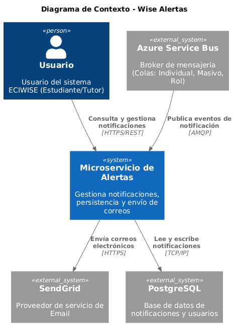
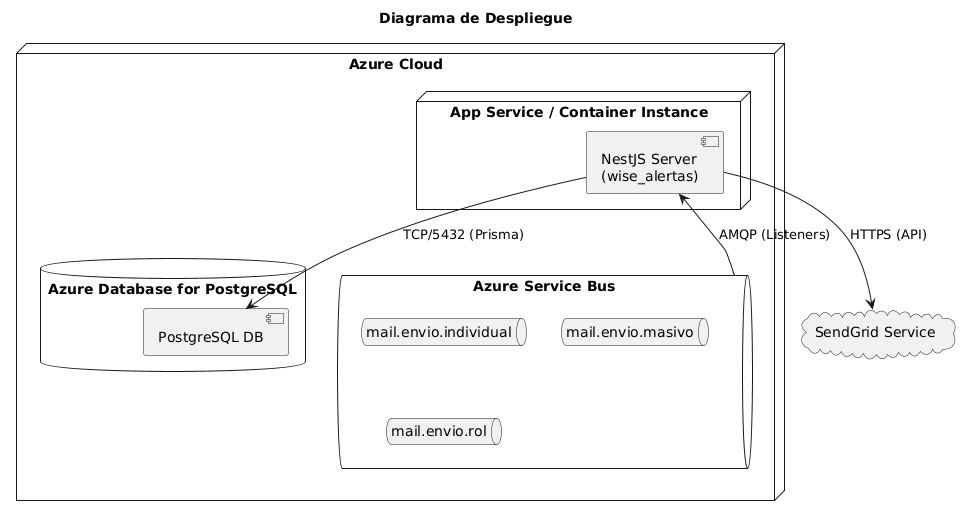
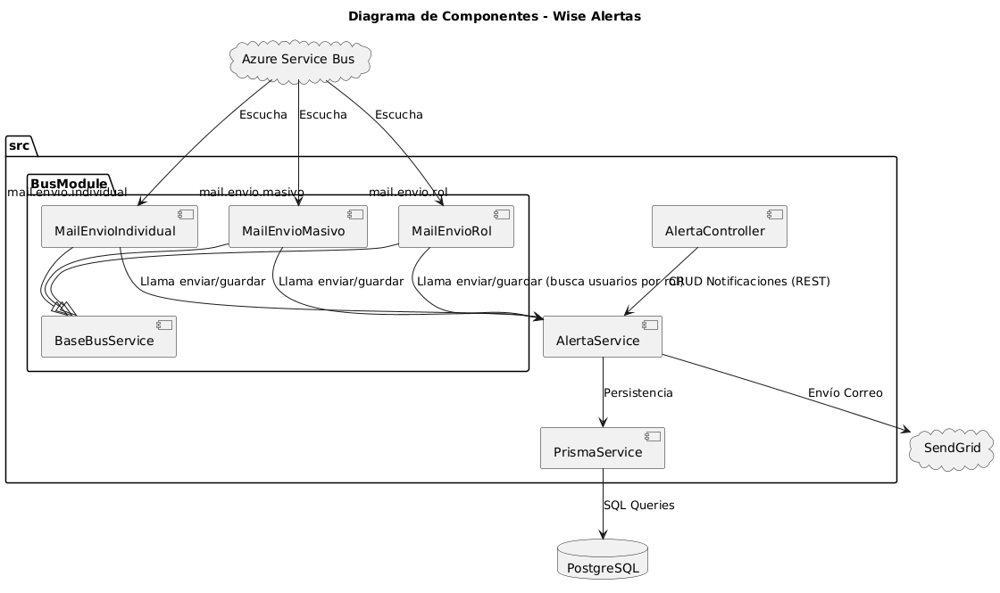
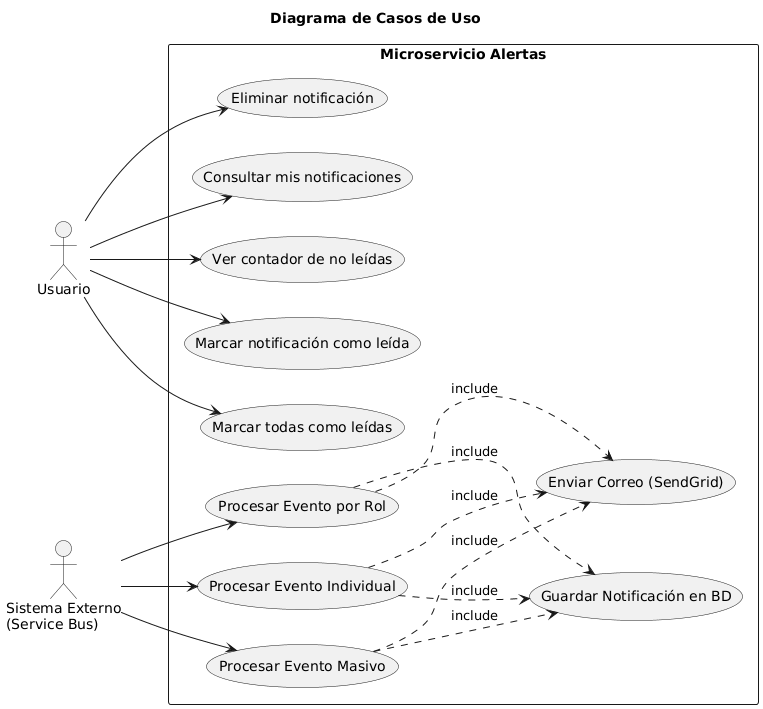
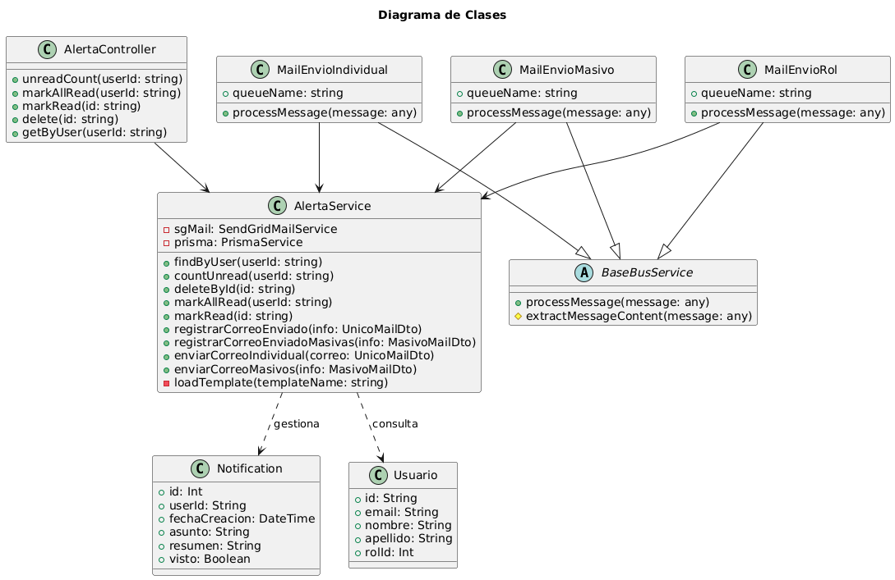
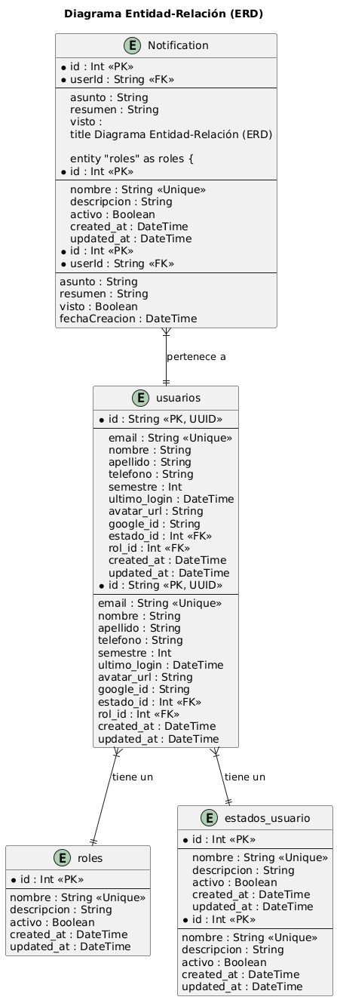

# WISE_ALERTAS

### Diagramas del Módulo

### Diagrama de contexto

**Descripción:**
Este diagrama ofrece una vista de alto nivel del sistema **Wise Alertas**, situándolo en su entorno operativo. Ilustra las interacciones principales entre el microservicio y los actores externos (usuarios y sistemas).

*   **Actor Principal (Usuario):** Representa a los estudiantes, tutores o administradores de la plataforma ECIWISE que interactúan con el sistema para consultar sus notificaciones a través de interfaces web o móviles.
*   **Sistema (Wise Alertas):** Es el núcleo de este repositorio. Actúa como una "caja negra" que centraliza la lógica de recepción de eventos, persistencia de notificaciones y despacho de correos electrónicos.
*   **Sistemas Externos:**
    *   **Azure Service Bus:** Actúa como el mecanismo de integración asíncrona. El sistema se suscribe a colas específicas (`mail.envio.individual`, `mail.envio.masivo`, `mail.envio.rol`) para recibir eventos disparados por otros microservicios de la arquitectura.
    *   **SendGrid:** Proveedor de infraestructura de correo electrónico (SaaS) utilizado para el envío fiable de emails transaccionales basados en plantillas HTML dinámicas.
    *   **PostgreSQL:** Sistema de gestión de base de datos relacional donde se almacena el historial de notificaciones, el estado de lectura y la información de usuarios necesaria para el mapeo de roles.

### Diagrama de despliegue

**Descripción:**
Este diagrama modela la arquitectura física y la distribución de los artefactos de software en la infraestructura de nube (Azure).

*   **Nodo de Computación (App Service / Container Instance):** El microservicio `wise_alertas` (NestJS) se ejecuta dentro de un entorno contenerizado o un servicio de aplicaciones en Azure. Este nodo es responsable de mantener los listeners de mensajería activos y exponer la API REST.
*   **Nodo de Datos (Azure Database for PostgreSQL):** Instancia gestionada de PostgreSQL que garantiza la persistencia, integridad y alta disponibilidad de los datos de notificaciones y usuarios. La conexión se realiza mediante TCP en el puerto estándar 5432.
*   **Nodo de Mensajería (Azure Service Bus):** Infraestructura de mensajería empresarial que desacopla los productores de eventos del microservicio de alertas. Se detallan las tres colas principales que alimentan el sistema.
*   **Servicio Externo (SendGrid):** Nube de terceros conectada vía HTTPS para la entrega final de correos electrónicos a los usuarios.

### Diagrama de Componentes Especificos

**Descripción:**
Este diagrama desglosa la estructura interna del microservicio, mostrando cómo se organizan y comunican los módulos de NestJS.

*   **Módulo de Bus (`BusModule`):** Contiene los servicios especializados (`MailEnvioIndividual`, `MailEnvioMasivo`, `MailEnvioRol`) que heredan de una clase base (`BaseBusService`). Estos componentes actúan como *consumers* o *listeners* que transforman los mensajes AMQP entrantes en llamadas a la lógica de negocio.
*   **Módulo de Alerta (`AlertaModule`):**
    *   **AlertaController:** Expone la interfaz REST para el frontend, manejando peticiones HTTP para lectura y actualización de estado de notificaciones.
    *   **AlertaService:** Centraliza la lógica de negocio. Orquesta la creación de registros en la base de datos (vía `PrismaService`) y el envío de correos (vía cliente de SendGrid).
*   **Capa de Datos (`PrismaService`):** Abstracción ORM que facilita la comunicación con PostgreSQL, permitiendo operaciones tipadas y seguras sobre las entidades.

### Diagrama de Casos de Uso

**Descripción:**
Este diagrama captura la funcionalidad del sistema desde la perspectiva de sus actores, definiendo el alcance funcional del microservicio.

*   **Actor Usuario:**
    *   **Gestión de Notificaciones:** Los usuarios pueden visualizar su historial de notificaciones, ver un contador en tiempo real de alertas no leídas (útil para indicadores de UI como "campanitas"), marcar notificaciones específicas o todas como leídas, y eliminar alertas que ya no son relevantes.
*   **Actor Sistema Externo (Service Bus):**
    *   **Procesamiento de Eventos:** El sistema reacciona automáticamente ante la llegada de mensajes a las colas. Se identifican tres casos de uso principales según el tipo de destinatario: envío a un usuario específico, envío masivo a una lista de correos, y envío dinámico basado en el rol del usuario (ej. "enviar a todos los tutores").
    *   **Acciones Automáticas:** Cada evento procesado desencadena dos acciones implícitas: el envío del correo electrónico correspondiente y, opcionalmente, el registro de la notificación en la base de datos para su visualización en la plataforma.

### Diagrama de Clases

**Descripción:**
Este diagrama representa la estructura estática del código fuente, detallando las clases clave, sus atributos, métodos y relaciones de dependencia o herencia.

*   **Patrón Controller-Service:** Se evidencia la separación de responsabilidades donde `AlertaController` maneja la capa de transporte HTTP y delega en `AlertaService` la lógica pura.
*   **Jerarquía de Listeners:** Muestra cómo `MailEnvioIndividual`, `MailEnvioMasivo` y `MailEnvioRol` extienden de la clase abstracta `BaseBusService`, promoviendo la reutilización de código para la conexión y gestión de errores con Azure Service Bus.
*   **DTOs (Data Transfer Objects):** Aunque simplificados en el diagrama, representan las estructuras de datos (`UnicoMailDto`, `MasivoMailDto`) que aseguran el tipado estricto de los mensajes recibidos.
*   **Modelos de Dominio:** Representación de las entidades `Notification` y `Usuario` tal como son manipuladas por el ORM y el servicio.

### Diagrama de Base de Datos

**Descripción:**
Este diagrama Entidad-Relación describe el esquema de datos implementado en PostgreSQL y gestionado por Prisma.

*   **Entidad `usuarios`:** Tabla central que almacena la información de perfil, autenticación (Google ID) y relaciones jerárquicas con `roles` y `estados_usuario`.
*   **Entidad `Notification`:** Tabla transaccional diseñada para almacenar las alertas generadas.
    *   **Relación:** Existe una relación de **uno a muchos** entre `usuarios` y `Notification` (un usuario puede tener muchas notificaciones, pero una notificación pertenece a un único usuario).
    *   **Clave Compuesta/Índices:** El diseño optimiza las consultas por `userId` para recuperar rápidamente el historial de un usuario específico.
*   **Tablas Catálogo (`roles`, `estados_usuario`):** Tablas maestras que normalizan la información de tipos de usuario y estados de cuenta, asegurando la integridad referencial.